# 분석 및 설계

[Wiki 페이지에서 확인하기](https://github.com/nmin11/hhplus-e-commerce/wiki)

## ⏰ 마일스톤

- [📅 프로젝트 칸반 보드](https://github.com/users/nmin11/projects/1/views/4?sortedBy%5Bdirection%5D=asc&sortedBy%5BcolumnId%5D=180643321)
- [🚀 마일스톤 목록](https://github.com/nmin11/hhplus-e-commerce/milestones)

## 🔁 시퀀스 다이어그램

### 사용자 잔액 충전

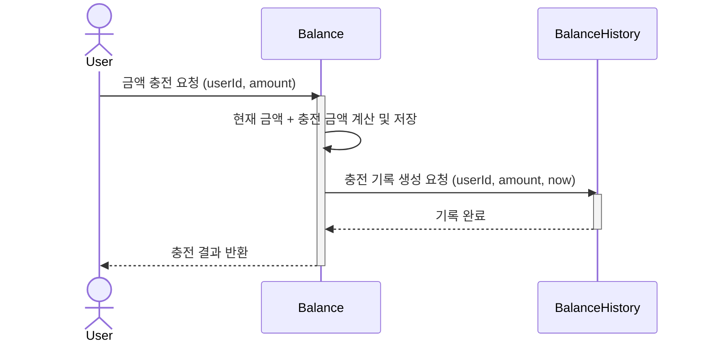

 

### 사용자 잔액 조회

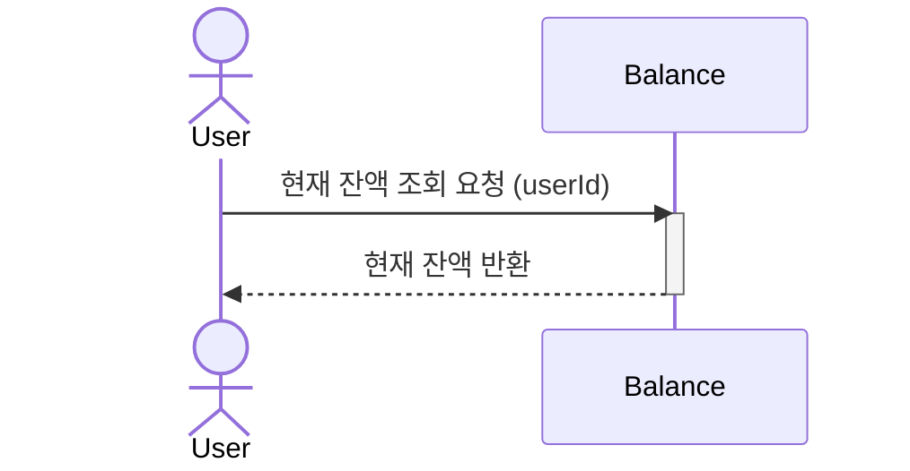

 

### 사용자 잔액 변경 내역 조회

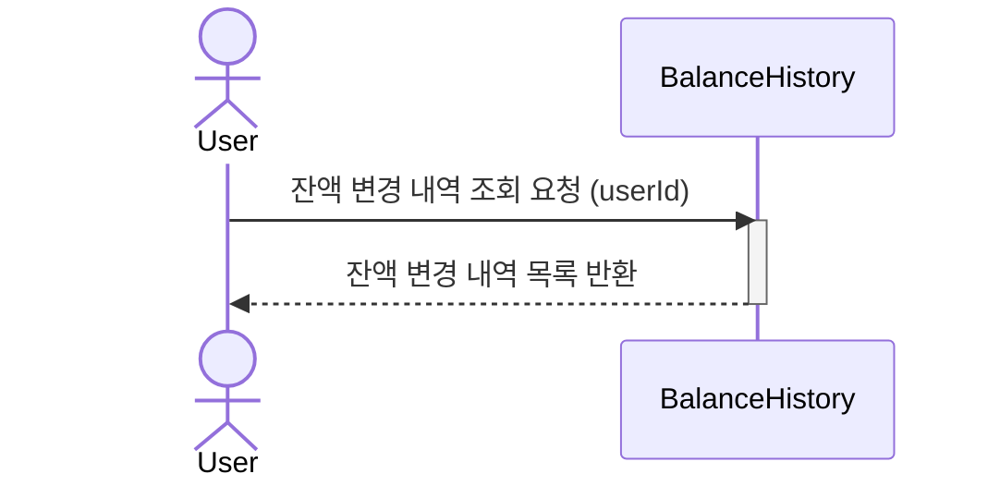

 

### 상품 목록 조회

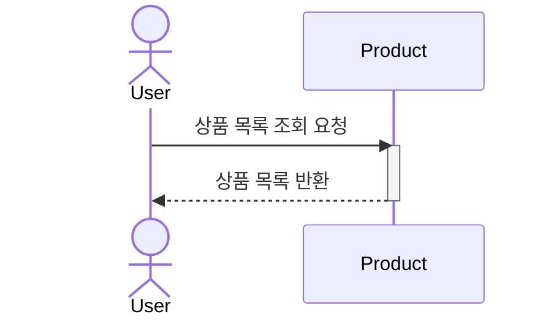

 

### 개별 상품 상세 조회

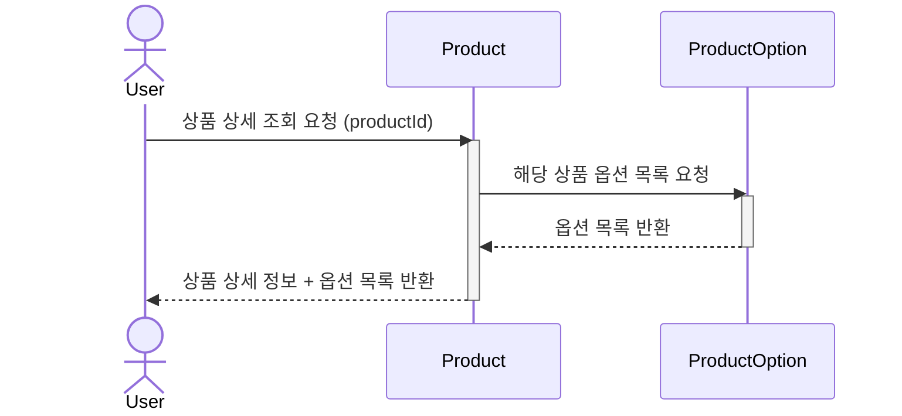

 

### 주문

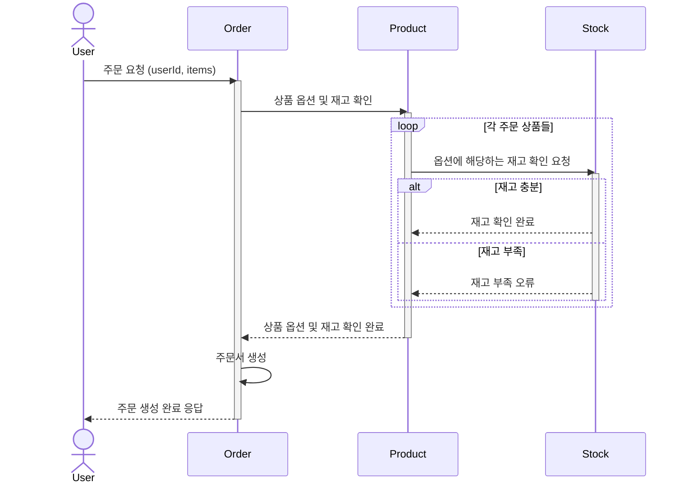

 

### 결제

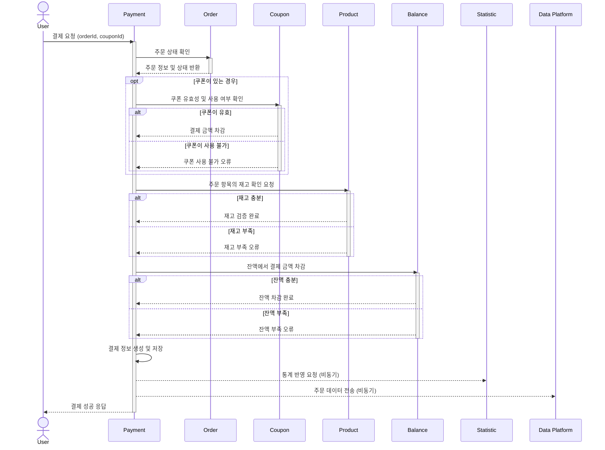

 

### 선착순 쿠폰 발급 요청

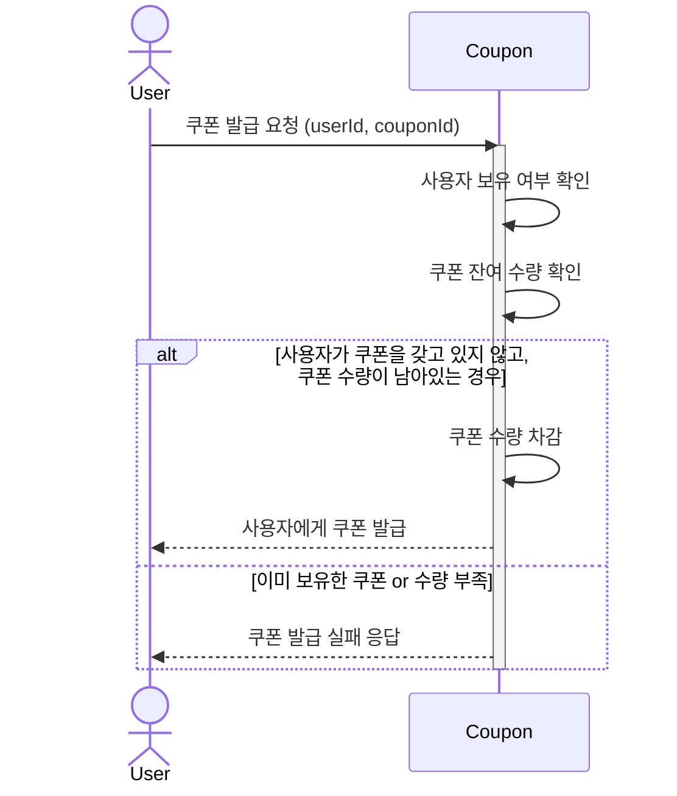

 

### 보유 쿠폰 조회

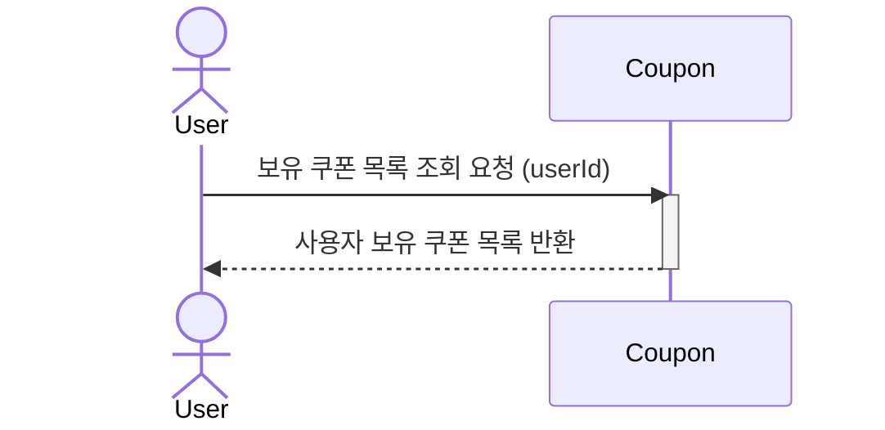

 

### 최근 인기 상품 조회

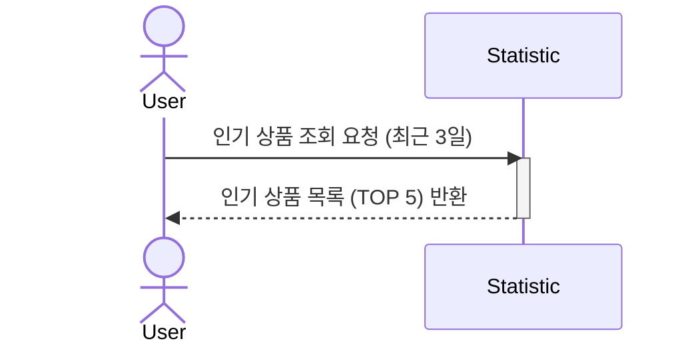

## 🧩 클래스 다이어그램

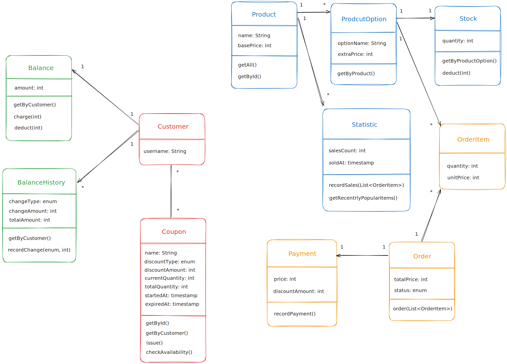

<a href="https://excalidraw.com/#json=Hc605C7zlAejmaIcTEZ-x,OcDHW0BjR6G1ap45K_0_bQ" target="_blank">
    웹에서 클래스 다이어그램 확인하기
</a>

## ⚒️ ERD

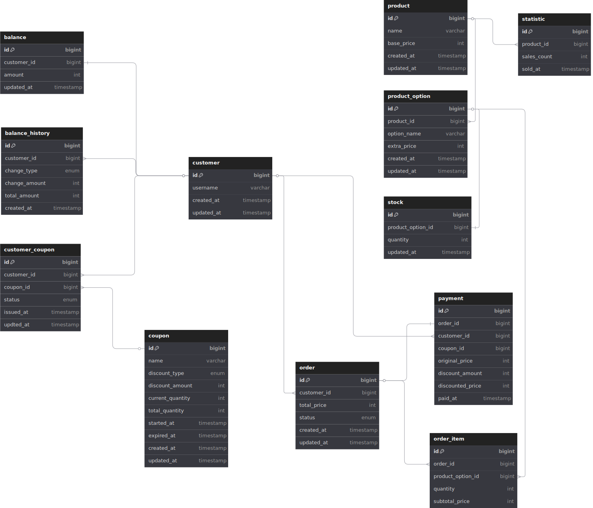

<a href="https://dbdiagram.io/d/hhplus-e-commerce-67ebd1d24f7afba184ef6b5b" target="_blank">
    웹에서 ERD 확인하기
</a>
