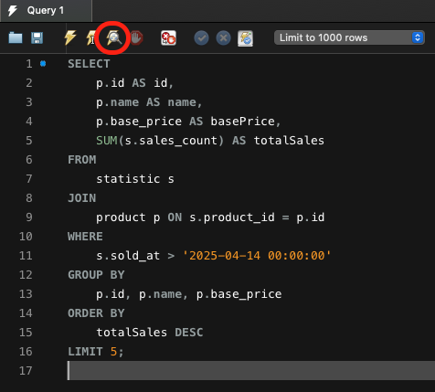
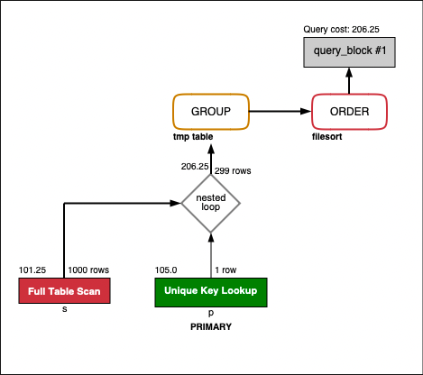
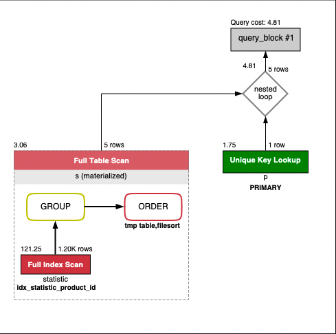

## 서론

안녕하세요. 항해 플러스 백엔드 8기 Kotlin 16팀 남궁민입니다.  
본 보고서는 프로젝트 내부에 병목 쿼리가 있는지 조사하고, 이를 개선하기 위한 목적으로 작성했습니다.  
현재 항해 플러스 과제로 개발 중인 E-커머스 서비스는 1주차 설계에 이어, 2주차 MVP 기능 구현, 3주차 DB 연동까지 진행되었습니다.  
과제의 다음 스텝으로 넘어가기 전에, 병목 쿼리를 어떻게 개선할 수 있는지 학습하기 위한 용도로서 본 보고서를 작성했습니다.  
특히, '최근 인기 상품 조회' 기능의 경우 여러 테이블을 JOIN하고 계산하는 로직이 포함되어 있으므로, 해당하는 쿼리에 대해 중점적으로 분석했습니다.

## 목차

- 병목 쿼리 조사 방식
- 최근 인기 상품 조회 쿼리 문제 분석
- 개선 방법: Subquery로 Top 5 상품 ID 미리 구하기
- 결론
- 용어 정리

## 병목 쿼리 조사 방식

저는 [Line 기술 블로그 - MySQL Workbench의 VISUAL EXPLAIN으로 인덱스 동작 확인하기](https://engineering.linecorp.com/ko/blog/mysql-workbench-visual-explain-index)라는 글을 읽고, 해당 글에서 소개해주는 기능을 활용했습니다.  
사실 몇 만 건 이상의 쿼리를 직접 실행하고 P90, P95, P99 등의 실행 시간 결과를 확인해볼 수도 있을 것입니다.  
하지만 k6, JMeter 등의 측정 도구를 배워야 한다는 러닝 커브가 존재하기도 하고, MySQL에 대한 기본기를 다지는 것이 지금 단계에서 더 효과적인 학습 방식이라는 생각도 들어서 MySQL Workbench를 사용하기로 결정했습니다.

MySQL Workbench의 VISUAL EXPAIN 사용 방법은 Line 기술 블로그에도 잘 설명되어 있는데, 쿼리를 작성하고 아래 이미지에 표시된 버튼을 눌러보는 것만으로 간단하게 활용할 수 있습니다.



- 테스트 환경 관련 추가 설명
  - `data.sql` 파일을 활용해 dummy data를 삽입해주는 방식을 사용했습니다.
    - 가용한 데이터 확인을 원하신다면 `resources/database/data.sql` 파일을 참고 부탁드립니다.
  - 상품 20개, 상품별 판매 통계 데이터 100건 삽입 후 테스트를 진행했습니다.

## 최근 인기 상품 조회 쿼리 문제 분석

첫 구현 단계에서 작성한 위 쿼리에 대해 분석해 본 결과 아래와 같은 문제점들이 도출되었습니다.



- `statistic` 테이블에 대한 Full Table Scan
- 299 rows를 그룹화(GROUP)할 때 tmp table 사용
- 정렬(ORDER)할 때 filesort 발생
- 이로 인해 전체 Query Cost가 206.25로 측정됨

분석 결과를 통해, GROUP BY + ORDER BY 조합으로 인해 디스크 I/O 부담이 크게 발생하는 것을 알 수 있습니다.  
이는 정렬 과정에서 적절한 Index를 사용하지 못하기 때문인 것으로 추정됩니다.  
또한, `statistic` 테이블에 대한 Full Scan 문제가 발생하고 있기는 합니다.  
하지만 MySQL Optimizer 특성상 Index Scan보다 Full Scan이 유리하다고 판단하는 경우도 있으므로 잠시 넘겨두었습니다.  
그보다는 우선적으로 GROUP - ORDER 조합의 높은 디스크 I/O 사용 문제부터 해결하기로 결정했습니다.

## 개선 방법: Subquery로 Top 5 상품 ID 미리 구하기

```sql
SELECT
    p.id AS id,
    p.name AS name,
    p.base_price AS basePrice,
    s.total_sales AS totalSales
FROM (
    SELECT
        product_id,
        SUM(sales_count) AS total_sales
    FROM
        statistic
    WHERE
        sold_at > '2025-04-14 00:00:00'
    GROUP BY
        product_id
    ORDER BY
        total_sales DESC
    LIMIT 5
) AS s
JOIN product p ON s.product_id = p.id;
```

Subquery를 통해 통계(`statistic`) 테이블에서 상품 ID와 누적 판매량만을 조회하고, Subquery 안에서 GROUP + ORDER + LIMIT 조합을 사용하도록 변경했습니다.  
이렇게 변경된 쿼리를 다시 VISUAL EXPLAIN 해본 결과, 아래와 같은 결과가 도출되었습니다.



- 총 Query Cost: 4.81
- Full Index Scan: Index를 활용해 `statistic` 테이블 스캔
  - 1.20K rows를 처리했으며, 121.25의 비용 소모
- Materialized Table Scan: 오직 5건에 대한 Full Scan
- GROUP + ORDER 과정에서 여전히 tmp table 및 filesort 사용

Subquery 도입 후 전체 Query Cost가 206.25 → 4.81로 약 43배 감소했습니다.  
기존에는 전체 테이블들에 대해 정렬 및 그룹화 연산을 수행했지만, 쿼리를 분리하고 나서는 Index를 적절히 활용하게 되었고, 메인 쿼리의 JOIN 대상도 5개로 크게 줄었습니다.

## 결론

이번 기회에 병목 쿼리를 해결하는 유용한 방법을 하나 알게 되었습니다.  
예전에는 '쿼리 성능 개선'을 위해서는 Bulk 연산을 해보고, 이에 대한 결과를 확인하며 병목 지점을 파악해야 한다고 생각했습니다.  
그런데 이처럼 MySQL Workbench의 기능을 활용해 비교적 적은 수의 데이터로도 충분히 쿼리의 성능을 분석하고 개선할 수 있다는 점을 깨달았습니다.

추가적으로 복합 Index를 적용해 조금 더 쿼리 성능을 개선해보고자 시도했습니다.  
하지만 SUM 및 ORDER 연산을 하기 때문에 해당 복합 Index를 활용하지 못하는 모습을 보였습니다.  
이번 사례를 통해 단순히 Index를 추가해주는 것보다도, 쿼리의 구조를 개선하는 것이 더 실질적인 성능 향상을 가져올 수 있다는 점을 확인할 수 있었습니다.

## 용어 정리

### Full Table Scan

테이블의 모든 행을 처음부터 끝까지 조회하는 방식입니다.  
조회를 하기 위해 적용 가능한 Index가 존재하지 않거나, 있더라도 처리 범위가 더 적은 경우에 발생합니다.  
MySQL Optimizer는 소규모 테이블이거나 통계 정보상 Index보다 효율적이라고 판단될 경우 Full Table Scan을 허용하기도 합니다.  
주로 `JOIN` 대상 테이블에 Index가 없거나, `LIKE '%keyword%'` 또는 계산식이 포함된 `WHERE` 절에서 자주 발생합니다.

### tmp table

MySQL 기준으로, 쿼리 실행 중간 결과를 임시로 생성하는 테이블입니다.  
사용자가 대규모 데이터를 처리하기 위한 용도로 직접 생성할 수도 있습니다.  
GROUP BY 쿼리를 사용할 경우 MySQL에서 자동으로 tmp table을 만들어서 중간 집계 작업을 수행합니다.

### filesort

MySQL이 정렬(ORDER) 작업을 수행하는 방식입니다.  
정렬 작업을 위해 Index를 활용하지 못하는 경우 사용되는 알고리즘입니다.  
Sort Buffer라는 메모리 공간을 사용하기 때문에 디스크 I/O를 발생시킨다는 단점이 있습니다.

### Query Cost

Optimizer가 SQL 문을 실행하기 위해 예상되는 I/O 작업의 수를 표현합니다.  
숫자가 적을수록 쿼리 실행 비용도 적다는 뜻으로 이해할 수 있습니다.  
`SELECT * FROM product WHERE id = 1` 같은 단순 조회 쿼리는 보통 Query Cost가 1 ~ 2 정도의 수준이기 때문에, 100 이상 넘어가면 상당히 복잡한 쿼리로 간주할 수 있습니다.  
Full Scan 같이 정확한 측정이 어려운 케이스들이 있기 때문에 상대적인 수치로서 참고하는 지표입니다.
