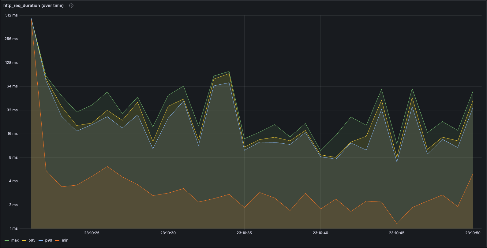
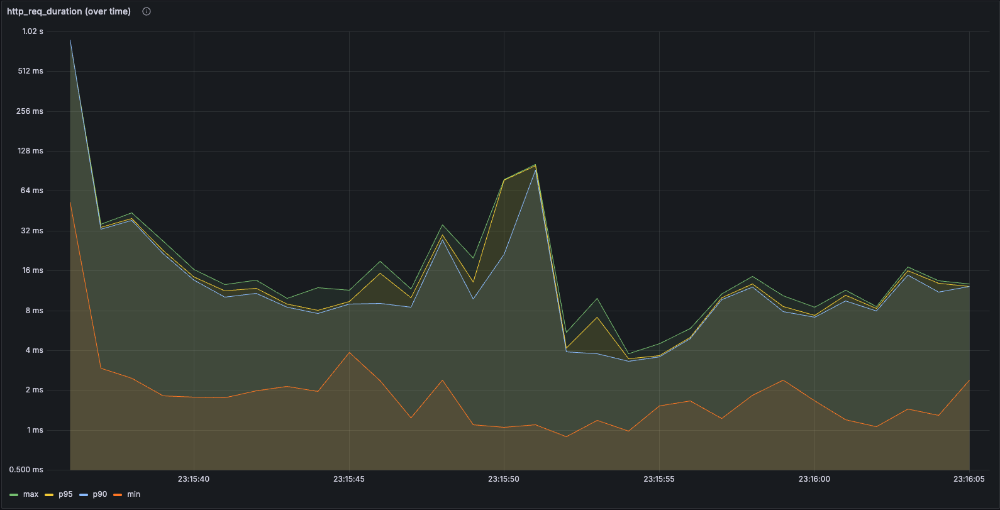
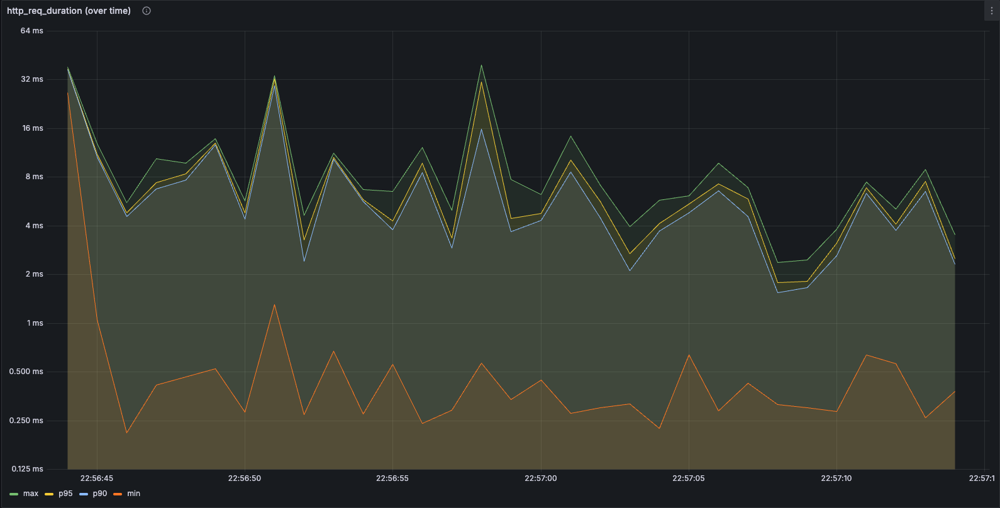

# 캐시를 활용해 인기 상품 조회 성능 향상시키기

## 서론

“인기 상품 조회”는 E-커머스 서비스의 핵심 기능 중 하나입니다.  
하지만 해당 기능은 내부적으로 랭킹을 집계하는 다소 복잡한 쿼리를 사용하기 때문에 트래픽이 몰릴 경우 응답 속도가 느려질 우려가 있습니다.

- 인기 상품 조회 쿼리

```sql
SELECT
    p.id AS id,
    p.name AS name,
    p.base_price AS basePrice,
    s.total_sales AS totalSales
FROM (
    SELECT
        product_id,
        SUM(sales_count) AS total_sales
    FROM
        statistic
    WHERE
        sold_at > '2025-05-01 00:00:00'
    GROUP BY
        product_id
    ORDER BY
        total_sales DESC
    LIMIT 5
) AS s
JOIN product p ON s.product_id = p.id;
```

이에 따라 저는 In-Memory 캐시와 Redis를 조합한 계층형 캐싱 전략을 도입하기로 결정했습니다.  
이 보고서에서는 구체적으로 어떤 캐싱 전략을 사용했는지, 그리고 이를 통해 성능이 얼만큼 향상되었는지를 기술하고자 합니다.

<br>

## 목차

- [캐싱 전략 선정하기](#캐싱-전략-선정하기)
- [성능 분석 방법](#성능-분석-방법)
- [성능 개선 결과](#성능-개선-결과)
- [결론](#결론)

<br>

## 캐싱 전략 선정하기

인기 상품 조회 기능은 시스템 내에서 가장 빈번하게 호출되는 기능 중 하나입니다.  
이에 따라 제가 구상한 캐싱 전략은 다음과 같습니다.

- 1차 캐시 (In-Memory)
    - 읽기 전략: Look Aside
    - 쓰기 전략: Write Around
    - TTL: 15분
    - 캐시 미스 발생 시 1차적으로 Redis 캐시에서, 2차적으로 DB에서 갱신
- 2차 캐시 (Redis)
    - 읽기 전략: Read Through
    - 쓰기 전략: Warm Cache
    - TTL: 13시간(스케쥴러), 12시간(캐시 미스 발생 시)
    - 스케쥴러는 11시 30분, 23시 30분에 13시간 TTL을 가진 캐시 갱신
    - 캐시 미스 발생 시 DB로부터 갱신

메인 캐시는 성능 최적화를 위해 데이터를 Redis에서만 읽어오는 **Read Through** 전략을 채택했습니다.  
이 전략은 항상 캐시를 우선 조회하기 때문에, 읽기 요청에 대해 빠른 응답 속도를 유지할 수 있다는 장점이 있습니다.  
하지만 캐시를 장시간 유지하는 경우가 많고, 이에 따라 **캐시 신선도**가 떨어질 수 있다는 단점도 존재합니다.  
따라서 적절한 **TTL(Time-To-Live)** 설정과 함께, 이를 보완해줄 **캐시 갱신 전략**이 반드시 병행되어야 합니다.  
저는 비즈니스 요건상, 인기 상품 페이지는 반나절 주기로 갱신되는 것이 적절하다고 판단하여, 12시간 단위로 캐시를 갱신하는 스케줄러를 구현했습니다.

그리고 저는 1차 캐시로서 In-Memory 캐시를 추가적으로 가용하는, **Layered Caching** 전략을 도입했습니다.  
In-Memory 캐시는 **Look Aside + Write Around** 전략을 활용하여, 캐시 미스 발생 시 Redis 캐시를 조회하고 이를 메모리 캐시에 저장하도록 구성했습니다.  
이를 통해 스파이크성 트래픽 상황에서도 응답 속도와 안정성을 유지할 수 있는 캐시 구조를 설계할 수 있었습니다.

<br>

## 성능 분석 방법

인기 상품 조회 기능에 대한 캐시 적용 전후의 성능 차이를 정량적으로 측정하기 위해 부하 테스트 환경을 구성하였습니다.  
이를 위해 k6, InfluxDB, Grafana 조합을 사용하였으며, docker-compose.yml을 통해 손쉽게 컨테이너 기반의 테스트 환경을 구성했습니다.

- docker-compose.yml

```yml
version: '3'

services:
  influxdb:
    image: influxdb:1.8
    container_name: influxdb
    ports:
      - "8086:8086"
    environment:
      - INFLUXDB_DB=k6
      - INFLUXDB_HTTP_AUTH_ENABLED=true
      - INFLUXDB_ADMIN_USER=admin
      - INFLUXDB_ADMIN_PASSWORD=root
    volumes:
      - influxdb_data:/var/lib/influxdb

  grafana:
    image: grafana/grafana
    container_name: grafana
    ports:
      - "3000:3000"
    environment:
      - GF_SECURITY_ADMIN_USER=admin
      - GF_SECURITY_ADMIN_PASSWORD=root
    volumes:
      - grafana_data:/var/lib/grafana

volumes:
  influxdb_data:
  grafana_data:
```

구성 요소들은 다음과 같습니다.

- **k6**: 부하 테스트 시나리오 실행 도구
- **InfluxDB**: k6로부터 수집한 메트릭을 저장하는 시계열 데이터베이스
- **Grafana**: 수집된 메트릭을 실시간으로 시각화하는 대시보드 도구

본 테스트에서는 캐시 적용에 따른 **응답 시간** 변화를 핵심 지표로서 수집했습니다.  
그리고 성능이 어떻게 변경되었는지 측정하기 위해 다음 3가지 시나리오로 테스트를 수행했습니다.

1. 캐시 미적용
2. Redis 단독 캐시
3. In-Memory + Redis 캐시

성능 측정을 위한 부하 테스트 스크립트는 아래와 같이 작성했습니다.

```js
import http from 'k6/http';
import { check, sleep } from 'k6';

export const options = {
  vus: 50,
  duration: '30s',
};

export default function () {
  const res = http.get('http://localhost:8080/products/popular?days=3');

  check(res, {
    'status was 200': (r) => r.status === 200,
    'body is not empty': (r) => r.body.length > 0,
  });

  sleep(0.5);
}
```

50명의 가상 유저가 30초 동안 0.5초 간격으로 동시에 요청하도록 설정했습니다.  
이 스크립트를 바탕으로 앞서 언급한 3가지 시나리오를 각각 독립적으로 실행하며 성능 데이터를 수집했습니다.

<br>

## 성능 개선 결과

### 캐시 미적용 시 성능 측정 결과



먼저 캐싱을 전혀 적용하지 않은 상태에서 부하 테스트를 진행했습니다.  
초반에 서버가 안정화되기 전에 응답 시간이 약 512ms에 육박했지만 이후에는 안정화된 모습을 보였습니다.  
하지만 p90 및 p95를 기준으로 봤을 때에도 응답 시간이 **약 8ms ~ 100ms** 수준으로 꽤나 들쭉날쭉한 현상을 보이고 있습니다.

<br>

### Redis 단독 캐시 성능 측정 결과



Redis 캐시만 적용하고 부하 테스트를 진행한 결과입니다.  
평균적인 응답 시간은 약 **4ms ~ 16ms**에 밀집해 있습니다.  
하지만 중간에 100ms 수준으로 응답 시간이 튀는 현상이 발생했는데, 이는 Redis I/O 부하나 네트워크 지연으로 인한 현상으로 보입니다.  
결과적으로, 전반적인 응답 시간은 줄어든 편이지만 Redis라는 외부 의존성으로 인해 원인을 명확히 파악하기 힘든 지연이 발생할 수 있다는 한계점이 존재합니다.

<br>

### In-Memory + Redis 캐시 성능 측정 결과



In-Memory 캐시와 Redis 캐시를 동시에 사용하는 **Layered Caching 전략**을 도입한 결과, 가장 안정적이고 일관된 성능을 보였습니다.  
전체 응답 시간이 약 40ms보다 낮은 수준으로 유지되었으며, 평균 응답 시간은 **8ms** 정도로 측정되었습니다.  
Redis 단독 캐시에 비해 비약적인 성능 향상이라고는 할 수는 없지만, 외부 의존성이 없는 In-Memory 캐시로 인해 보다 더 안정적이고 일관된 성능을 보장할 수 있게 되었습니다.

<br>

이처럼 캐싱 전략을 도입함에 따라 응답 시간과 안정성이 향상되었습니다.  
단순 Redis 캐시만으로도 눈에 띄는 성능 개선이 가능했지만, 네트워크 지연 등 외부 요인에 취약한 단점이 존재했습니다.  
반면, In-Memory 캐시를 1차 캐시로 병행한 Layered Caching 전략은 보다 낮은 응답 시간과 예측 가능한 성능을 동시에 확보할 수 있는 구조였습니다.  
결과적으로, 인기 상품 조회와 같이 반복적이고 읽기 중심적인 요청에 있어서는 **Layered Caching 전략**이 합리적인 선택이 될 수 있음을 알 수 있었습니다.

<br>

## 결론

인기 상품 조회 기능에 캐시를 적용함으로써 **조회 성능을 안정화**하고, **외부 의존성을 분산하는 구조적 개선**을 이끌어낼 수 있었습니다.  
In-Memory와 Redis를 조합한 **Layered Caching 전략**은 일관된 응답 시간을 보장하는 데 효과적이었으며, 부하 테스트 결과에서도 캐시 적용에 따라 응답 속도와 안정성이 크게 달라지는 양상을 확인할 수 있었습니다.

다만 이번 테스트는 DB, Redis 모두 로컬 환경에서 가용했기 때문에 성능 개선의 효과가 뚜렷하게 드러나지는 않았습니다.  
그로 인해 절대적인 수치 상의 차이는 뚜렷하지 않을 수 있지만, 각 캐싱 전략의 상대적인 효과는 충분히 확인할 수 있었습니다.

이번 기회를 통해 단순히 캐시를 적용하는 것 자체를 넘어서, 어떤 상황에서 어떤 캐싱 전략을 선택하고, 어떻게 TTL을 설정하며, 어떤 시점에 캐시를 갱신할 것인지에 대한 설계가 얼마나 중요한지를 체감할 수 있었습니다.  
앞으로도 캐시를 도입할 때 단순한 성능 개선 수단으로서 접근하기보다는, 정합성, 신선도, 운영 효율성까지 함께 고려하는 방향으로 설계해 나가야겠다는 교훈을 얻을 수 있었습니다.
