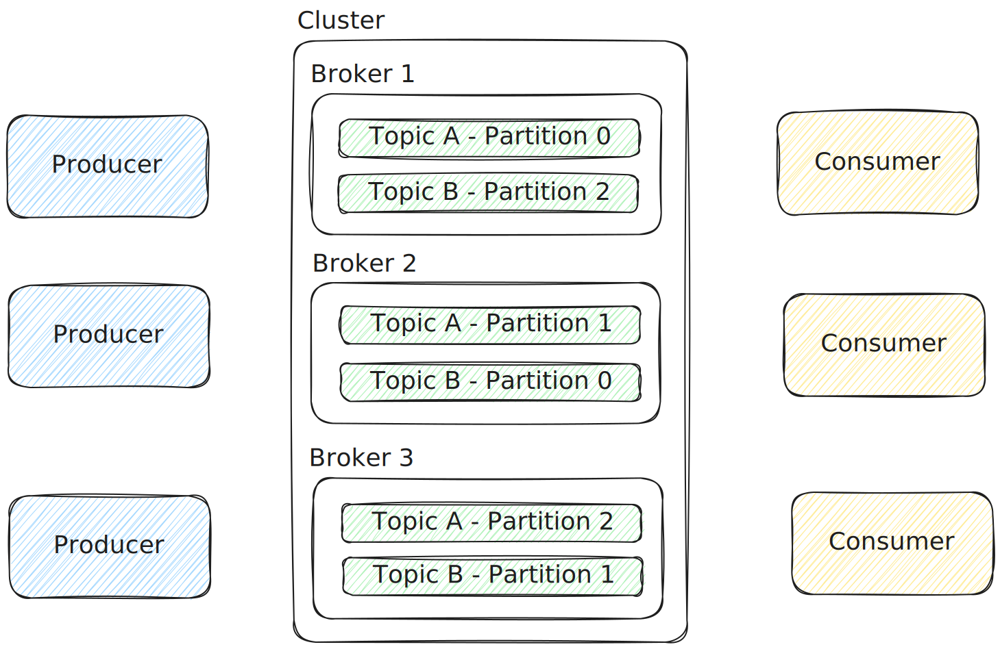
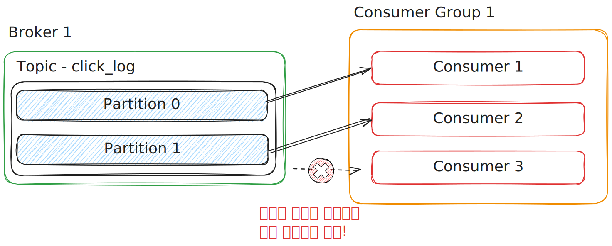
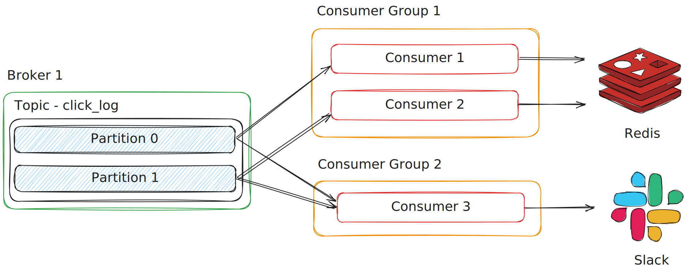
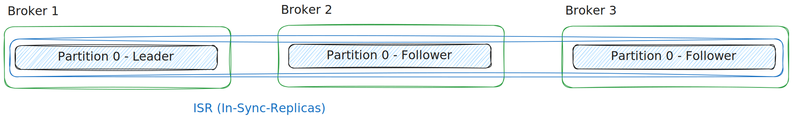

# Kafka 기본 개념 학습하기

## 1. Kafka란?

Kafka는 Apache 재단에 의해 개발된 오픈소스 **분산 메시징 시스템**입니다.  
대용량의 데이터를 빠르고 안정적으로 처리할 수 있으며, 다양한 시스템 간 데이터를 주고받을 수 있도록 **중간에서 메시지를 전달하는 역할**을 수행합니다.  
Kafka는 **Producer**가 보낸 메시지를 **Broker**에 저장하고, 이를 **Consumer**가 가져와서 처리하는 구조로 이루어져 있습니다.

 

## 2. Topic & Partition

Topic은 **메시지를 저장하는 단위**입니다.  
하나의 클러스터 안에 여러 Topic이 존재할 수 있으며, 또한 Topic은 여러 개의 Partition을 포함할 수 있습니다.  
Partition은 동일한 Topic 대상의 메시지들을 병렬로 처리하기 위해 존재합니다.

### 특징

- 각 Topic은 이름을 가질 수 있으며, 이에 따라 메시지를 용도에 맞게 구분할 수 있음
  - 예시: `click_log`, `send_sms`, `location_log`
- 메시지에 key 값이 존재하는 경우, 키의 Hash 값을 기반으로 **특정 파티션에 고정적으로** 할당
- 메시지에 key 값이 없는 경우, **Round Robin** 방식으로 여러 파티션에 분산 저장
- 메시지는 설정된 Retention 기간 동안 저장되며, Consumer가 메시지를 소비해도 삭제되지 않음
- 메시지 Retention 설정 방법
  - `log.retention.ms`: 최대 저장 시간
  - `log.retention.bytes`: 최대 저장 용량

### 소비된 메시지를 왜 남기는 것일까?

데이터를 중복으로 처리하기 위해서입니다.  
예를 들어, 상품을 주문했을 때 상품 랭킹 업데이트, 주문 정보를 외부 플랫폼으로 보내기 등 여러 작업을 동시에 수행하고 싶다면 동일한 메시지를 중복으로 처리해야 할 것입니다.  
Kafka에서는 소비된 메시지도 남겨둠으로써 메시지를 중복 처리할 수 있게 해두었고, 이는 Kafka를 사용하는 중요한 하나의 이유이기도 합니다.

단, 이러한 방법을 활용하려면 메시지를 소비하고자 하는 Consumer Group이 서로 달라야 하며, 추가적인 옵션 값이 필요합니다.  
`auto.offset.reset = earliest` 옵션은 커밋 기록이 없을 경우, 처음부터 메시지를 읽어오는 옵션입니다.  
서로 다른 Cosumer Group 끼리 다른 커밋 기록을 가지므로, 이 옵션을 활용해서 메시지를 중복으로 처리할 수 있습니다.

> ⚠️ WARNING: Partition은 늘릴 수는 있지만 줄일 수 없습니다.  
> 이는 Partition에 남아 있는 기존 메시지를 처리할 수 없기 때문이며, 따라서 처음 설정할 때 최소 Partition 개수를 요건에 맞게 선정하는 것이 중요합니다.  
> Partition을 늘리는 것은 가능하며, 이 작업을 통해 데이터를 더욱 분산해서 처리할 수 있습니다.

 

## 3. Producer

Producer는 메시지를 생성하고 Topic에 전송하는 역할을 수행합니다.  
특정 Topic 대상으로 메시지를 publish 할 수 있으며, 전송 실패 시 재시도할 수 있습니다.

### 데이터 전송 보장 방식 (`acks`)

Broker가 메시지를 전달받았다는 것을 보장하기 위한 용도로 `acks` 값을 지정해야 합니다.  
세부 값으로 `0`, `1`, `all` 중에 선택해서 지정해야 합니다.

- `0`: Leader Partition에 데이터 전송 후, 응답값을 받지 않음
  - 전송 성공 여부, 복제본 복사 여부를 보장할 수 없음
- `1`: Leader Partition으로부터 데이터 전송 성공 여부를 응답 받음 (기본값)
- `all`: Follower Partition까지 복제가 이루어졌는지를 포함해서 응답 받음
  - 데이터 유실이 없다고 보면 되지만, 속도가 현저히 느려짐
  - 표기상 `-1`로 표시하기도 함

### 재시도 (`retries`)

메시지 전송에 실패할 경우 지정 횟수만큼 자동으로 재전송을 시도하게 합니다.  
기본값은 `0`입니다.

### 배치 전송 (`linger.ms`, `batch.size`)

데이터가 어느 정도 모일 때까지 기다린 다음 한 번에 전송할 수 있습니다.  
이로 인한 대기 시간은 늘어나겠지만, 네트워크 통신 효율을 줄일 수 있다는 장점이 있습니다.

- `linger.ms`: 최대 몇 ms 동안 데이터를 모을지 지정함 (기본값: `0`)
- `batch.size`: 데이터 전송 최대 크기 (기본값: `16384` = 16KB)

### 중복 없는 전송 (`enable.idempotence`)

네트워크 문제 혹은 재시도 설정(`retries`)으로 인해 같은 메시지가 중복으로 전송될 수 있습니다.  
이를 방지하고 **Exactly-once**를 보장하려면 `enable.idempotence` 설정을 `true`로 지정해야 합니다.  
이 옵션을 사용할 경우, 메시지 순서 보장을 위해 `acks = all` 설정을 하고, `max.in.flight.requests.per.connection`을 5 이하로 제한하는 것이 좋습니다.

 

## 4. Consumer & Consumer Group

Consumer의 역할은 크게 3가지로 볼 수 있습니다.

- Topic의 Partition으로부터 데이터 polling
- Partition 내 offset 위치 기록 (commit)
- Consumer Group을 활용한 병렬 처리

### offset 기록 방식

Consumer는 메시지를 읽고 난 후 **Offset 기록(commit)** 을 해서 읽기 상태를 추적합니다.  
offset은 Kafka 내부 Topic인 `__consumer_offsets`에 저장됩니다.  
만약 Consumer가 비정상적으로 중지되었다 하더라도 재가동되었을 때 offset을 기준으로 메시지를 처리할 수 있게 되므로, **고가용성**의 특징을 포함한다고 할 수 있습니다.

### 자동 커밋, 수동 커밋 (`enable.auto.commit`)

`enable.auto.commit` 옵션은 기본값이 `true`로 되어있어서 기본 5초마다 자동으로 커밋됩니다.  
만약 자동 커밋 주기를 변경하고 싶다면 `auto.commit.interval.ms` 옵션을 통해 조정할 수도 있습니다.  
수동 커밋 방식의 경우, Consumer에서 메시지를 처리한 이후 명시적으로 커밋을 해주어야만 합니다.

### Consumer의 개수는 Partition의 개수와 같거나 보다 작아야 한다

Consumer의 개수가 Partition의 개수보다 많아질 경우, 아무 동작도 할 수 없는 Consumer가 생기게 됩니다.  
따라서 Consumer의 개수는 Partition의 개수와 같거나 적도록 유지해야 합니다.

### Consumer Group

같은 Group ID를 가진 Consumer들은 하나의 Consumer Group으로 묶입니다.  
Consumer Group을 생성하면 각 Partition의 메시지들을 여러 Consumer로 분산시켜서 처리할 수 있습니다.  
또한 여러 Consumer Group을 만들어서 같은 Partition의 메시지를 중복으로 처리하는 구조도 만들 수 있습니다.

이는 `__consumer_offset` Topic이 Consumer Group 별로 다르게 저장되기 때문에 가능한 부분입니다.

### Consumer Group의 offset 재설정 (`auto.offset.reset`)

새 Consumer Group의 Consumer가 처음 시작할 때 커밋 정보가 없다면 어디서부터 offset을 읽을지 정하는 옵션입니다.

- `earliest`: 가장 오래된 메시지부터
- `latest`: 가장 최근 메시지부터
- `none`: 커밋 정보가 없으면 예외 발생
  - 명시적 커밋 제어 필요

 

## 5. Replication

Replication은 Kafka의 **결함 내성(Fault Tolerance)** 을 보장하는 핵심 매커니즘입니다.  
Kafka는 Partition을 여러 Broker에 복제해서 Broker 장애가 발생해도 서비스가 지속 가능하도록 합니다.

### 구성 요소

- **Leader Partition**: 실제로 데이터를 읽고 쓰는 대상으로, Producer 및 Consumer는 Leader와 직접 통신
- **Follower Partition**: Leader와 같은 Topic의 동일한 Partition ID를 가진 복제본들입니다.
- **ISR (In-Sync-Replicas)**: Leader 및 동기화되어 있는 복제본들의 집합입니다.

### 작동 방식

Producer는 항상 Leader Partition에 데이터를 보내며, 이에 대한 응답은 앞서 언급한 `acks` 값에 따라 복제 여부까지 기다릴지를 결정합니다.  
그리고 Leader가 속한 Broker에 장애가 발생할 경우, Kafka는 ISR의 Follower 중 하나를 새로운 Leader로 선출합니다.

### 복제본 관련 설정 (`replication.factor`, `min.insync.replicas`)

`replication.factor`

- Partition을 몇 개의 Broker에 복제할지 설정
- Topic 생성 시점에 지정하며, 이후 변경 불가능
- Broker 개수를 초과하는 숫자 설정은 불가능
- 일반적으로 Broker가 3개 이상일 때 `replication.factor = 3`으로 설정

`min.insync.replicas`

- 최소 몇 개의 복제본이 살아 있어야 쓰기(produce)가 가능한지 결정
- 데이터 유실 방지 및 운영 보호 장치로 사용됨

Kafka에서 설정하는 권장 값

| 설정 항목                   | 권장값        | 설명 |
|:--------------------------:|:---------:|------|
| `acks`                     | `all`         | ISR 전체 복제 완료 시에만 성공 응답 반환 |
| `replication.factor`       | `3`           | 복제본 개수 3개 |
| `min.insync.replicas`      | `2`           | 최소한 ISR에 2개 이상 복제되어야 쓰기 허용 |

 

## 6. Rebalancing

Kafka는 Consumer Group 내에서 Partition ↔ Consumer의 매핑 관계를 동적으로 관리합니다.  
만약 특정 Consumer에 문제가 생겼을 경우 Partition에 대한 소유권을 다른 Consumer에게 이관하는 작업이 수행되며, 이를 Rebalancing이라고 부릅니다.

### Consumer Group Rebalancing 발생 시점

- Consumer 생성 및 삭제
- polling 요청 실패
  - 메시지 처리 시간이 `max.poll.interval.ms` 설정값보다 길어지면 문제가 있다고 판단
- Consumer heartbeat 실패

### 작동 순서

1. 기존 Consumer들은 할당 받은 Partition을 모두 반환
2. Kafka가 새로운 할당 계획 수립
3. 각 Consumer들에게 Partition 재할당
4. 메시지 처리 재개

### 문제점

**Stop-The-World 발생**

리밸런싱 작업이 완료되기 전까지 Consumer들이 동작하지 못합니다.  
그러므로 만약 리밸런싱이 자주 발생한다면 전체 시스템의 처리 성능이 떨어질 수 있습니다.

**메시지 중복 컨슈밍**

offset에 대한 커밋이 진행되기 전에 리밸런싱 작업이 수행될 수 있습니다.  
이러한 경우 리밸런싱 작업이 끝난 후에 동일한 메시지를 중복으로 처리하게 될 수 있습니다.

### 문제점 최소화 전략

**`max.poll.records` 줄이기**

이 설정값이 작을수록 polling 요청을 빠르게 보낼 수 있습니다.  
이에 따라 메시지 처리 시간이 `max.poll.interval.ms` 설정값보다 낮아지게 되는 경우가 많아져서 리밸런싱 발생 가능성 자체를 낮출 수 있습니다.

**수동 커밋 사용**

메시지가 처리되는 시점에 명시적 커밋을 하게 되면 메시지를 중복으로 처리할 문제의 소지를 줄일 수 있습니다.

 

## 7. Learn More Things

아래 개념들은 Kafka를 더 깊이 이해하고, 실무 운영에 더욱 깊숙이 활용하고자 할 때 알아두면 유익할 내용들입니다.

### Lag

Kafka 운영에 있어서 아주 중요한 모니터링 지표 중 하나입니다.  
Producer가 메시지를 넣는 속도가 Conumser가 메시지를 처리하는 속도보다 빠른 경우, 서로의 offset 간의 차이가 발생하며, 이를 **Consumer Lag**이라고 부릅니다.  
주로 Consumer의 상태를 측정할 때 사용되는 지표입니다.  
만약 하나의 Consumer가 여러 Partition의 데이터를 처리하는 경우, Lag은 처리하는 Partition의 개수만큼이며, 여러 개의 Lag 중 가장 높은 숫자의 Lag을 `records-lag-max`로 확인합니다.

### Partitioner

Producer가 Partition으로 메시지를 전송할 때, 무조건 **Partitioner를 통해서** 전송합니다.  
그리고 Partitioner는 **메시지를 Topic의 어떤 Partition에 넣을지 결정**하는 역할을 수행합니다.  
Partitioner를 별도로 설정하지 않을 경우 `UniformStickyPartitioner`로 설정되며, 이 Partitioner는 메시지 키의 해쉬 값을 기반으로 Partition을 지정합니다.  
Kafka는 Partitioner 인터페이스를 제공하므로 원하는 경우 커스텀 Partitioner를 만들어서 Topic 이름, 메시지 키, 메시지 값에 따라 어느 Partition에 보낼지 결정하도록 만들 수 있습니다.

### Kafka Streams

Kafka에서 공식으로 제공하는 고수준 스트림 처리 라이브러리입니다.  
데이터를 실시간으로 변경하거나 집계하는 등의 작업을 애플리케이션 내에서 직접 처리할 수 있게 해줍니다.

### Burrow

Consumer Lag을 모니터링하는 도구입니다.  
멀티 Kafka 클러스터를 지원하며, Sliding Window 방식으로 Consumer의 상태를 확인할 수 있습니다.  
또한 HTTP API를 제공하기 때문에 다양한 방식을 응용해서 사용할 수 있습니다.

### Transactions

**Exactly-once** 처리를 보장하는 도구입니다.  
여러 레코드를 원자 단위 데이터로 처리하도록 설계되었으며, Consumer의 커밋 작업을 트랜잭션에 포함시키는 기능도 포함되어 있습니다.
