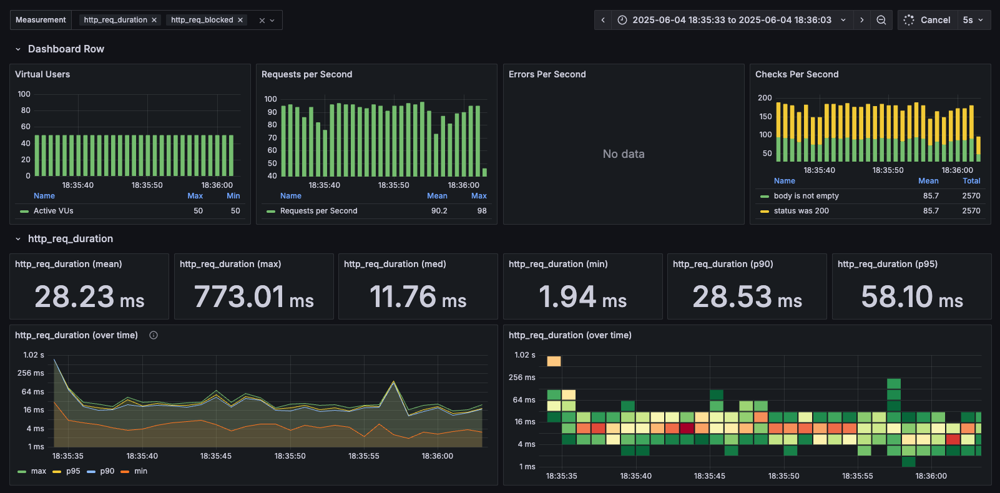

# 부하 테스트 설계 문서

## 서론

현재 우리 E-커머스 서비스는 MVP로서 갖춰야 할 핵심적인 기능들에 대한 구현을 끝마친 상태입니다.  
그리고 이제는 배포 단계에 앞서, 서비스의 안정성 및 성능을 검증할 차례입니다.

개발 단계에서도 동시성 제어 로직, 이벤트 기반의 분산 트랜잭션 등을 적용하여 안정성 및 가용성을 높여 왔습니다.  
하지만 실제로 서비스가 배포된 환경에서 단기간에 많은 트래픽을 받았을 때 서비스가 어떤 반응을 보일지는 여전히 예측이 불가능합니다.

이에 따라 부하 테스트의 필요성이 대두되었으며, 본 보고서에서는 어떤 방향으로 서비스에 대한 부하 테스트를 진행할 것인지에 대해 기술할 예정입니다.

<br>

## 부하 테스트 목표 및 설계 방향

### 테스트 대상 선정 및 이유

이번 부하 테스트에서는 다음 2가지의 핵심 기능들을 중점적으로 테스트할 계획입니다.

- **선착순 쿠폰 발급 API**

선착순 쿠폰 발급 이벤트를 진행할 경우, 수천 명이 동시에 쿠폰 발급을 요청할 수 있습니다.  
따라서 우리 서비스의 쿠폰 발급 API가 **단기간의 스파이크 트래픽**을 견뎌낼 수 있을지에 대한 검증이 필요합니다.

- **주문 및 결제 API**

주문 및 결제 API는 우리 서비스의 핵심적인 기능들이라고 할 수 있으며, 안정적인 정합성이 무엇보다도 중요하게 여겨지는 포인트입니다.  
그러므로 지속적인 트래픽 부하 상황에서도 안정적으로 기능을 수행하는지 검증되어야 합니다.

### SLA / SLO / SLI 정의

**SLA(Service Level Agreement)**

현재 우리 서비스는 아직 MVP 단계입니다.  
따라서 고객에게 **SLA**를 법적으로 확실하게 보장할 수 있도록 해주는 운영 지표 및 실측 데이터가 미비한 상태입니다.  
그러므로 현 단계에서 진행할 부하 테스트에서는 내부적으로 설정한 목표치인 **SLO**를 기준점으로 삼고, 실제 테스트를 통해 **SLI**가 어떻게 계측되는지를 중점적으로 살펴볼 계획입니다.  
본 부하 테스트 단계 이후에 명시적인 **SLA** 도출을 위한 경영진과의 협의가 진행될 것으로 예상됩니다.

**SLO(Service Level Objective)**

본 테스트에서는 시스템의 핵심적인 기능들이 얼마나 안정적이고 빠르게 응답하는지를 검증하고자 합니다.  
이를 위해 각 테스트 대상에 대해 다음과 같은 **SLO**를 설정했습니다.

| 테스트 대상           | Success Rate 기준                            | Latency 기준           |
|------------------------|----------------------------------------------|-------------------------|
| 선착순 쿠폰 발급 (Peak Test) | 99% 이상<br>(HTTP 201, 409 응답을 정상으로 간주) | P95 500ms 이하         |
| 주문 및 결제 (Load Test)     | 99.9% 이상                                 | P90 1초 이하            |

선착순 쿠폰 발급 기능은 순간적인 트래픽 부하에도 빠른 처리율을 가진 API를 제공할 수 있도록 하는 데에 초점을 뒀습니다.  
따라서 성공률보다도 **높은 처리율에 따른 낮은 지연 시간**을 보이는지를 중점적으로 살펴보고자 합니다.

그리고 주문 및 결제 API는 그 무엇보다도 **정합성**이 중요하다고 판단했습니다.  
따라서 RPS는 1초 정도로 다소 낮을지 몰라도, 성공률을 99.9% 수준으로 최대한 보장하는 쪽으로 방향을 잡았습니다.

**SLI(Service Level Indicator)**

이번 부하 테스트에서는 응답 성공률(HTTP 201, 409) 및 응답 지연 시간(P95, P99)을 주요 **SLI** 지표로 활용할 예정입니다.  
**SLI** 지표들은 **SLO** 목표치와 비교해서 서비스의 안정성 및 성능을 판단할 수 있는 합리적인 근거로서 제공될 예정이며, 추후 **SLA**를 도출해내는 데에도 핵심적인 역할을 수행할 것입니다.

실제 SLI 수치 결과들은 부하 테스트 결과를 진행한 이후 결과 보고서에서 자세하게 다룰 예정입니다.

<br>

## 부하 테스트 세부사항

### Spring 애플리케이션을 Docker로 실행하기

본격적으로 부하 테스트를 진행하기에 앞서, 기존에 로컬 환경에서만 실행해보던 개발 환경을 Docker 환경으로도 구성해보기로 했습니다.  
본 작업은 배포 환경에서의 CPU, 메모리 제약에 따른 실제 부하 요청 처리 수행 능력을 최대한 같게 맞추기 위해서 진행되었습니다.

**Dockerfile**

```sh
FROM amazoncorretto:17.0.15
COPY build/libs/app.jar app.jar
EXPOSE 8080
ENV JAVA_OPTS=""
ENTRYPOINT ["sh", "-c", "java $JAVA_OPTS -jar app.jar"]
```

`app.jar` 파일로 빌드된 Spring 애플리케이션을 기존에 사용하던 Java 17 버전의 이미지와 함께 실행합니다.  
`docker run` 명령어를 실행할 때, 추가적인 Java 실행 옵션을 부여할 수 있도록 구성했습니다.

**Docker 실행 스크립트**

```sh
#!/bin/bash

IMAGE_NAME="hhplus-e-commerce-image"
CONTAINER_NAME="hhplus-e-commerce"
NETWORK_NAME="hhplus-e-commerce_hhplus-net"

docker build -t $IMAGE_NAME .
docker rm -f $CONTAINER_NAME 2>/dev/null || true
docker run --rm -p 8080:8080 \
  --name $CONTAINER_NAME \
  --network $NETWORK_NAME \
  --cpus="4.0" \
  --memory="10g" \
  -e JAVA_OPTS="-Xms1024m -Xmx8192m" \
  -e SPRING_PROFILES_ACTIVE=dev \
  $IMAGE_NAME
```

Dockerfile을 참조하여 컨테이너를 빌드하고 실행합니다.

`--cpus="4.0"` 및 `--memory="10g"` 설정은 테스트 시나리오에서 사용할 부하량을 기준으로 역산해서 산정한 값입니다.  
테스트 대상 중, 선착순 쿠폰 발급 기능에 대한 Peak Test는 순간적인 높은 트래픽을 예상해서 VU를 1,500 단위로 설정했습니다.  
이러한 부하 테스트 수준을 감당할 수 있도록, CPU 및 메모리 설정을 다소 높게 정해두었습니다.

CPU 설정은 주로 Spring Boot 초기 구동 과정에서 핵심적으로 쓰이지만, 가동 중 메모리가 부족해질 때 사용률이 높아질 수 있으므로 이에 알맞은 넉넉하게 **4 코어**로 설정했습니다.  
그리고 메모리 설정은 다소 추상적인 값이긴 합니다만, 1,500 VU가 초당 15,000개의 요청을 전송한다고 가정했고, 각 요청은 100KB의 메모리를 사용한다고 했을 때, 총 1.5GB의 메모리를 지속적으로 사용한다고 예상했습니다.  
여기에 실제 GC 버퍼 및 각종 Spring 객체들의 메모리 크기를 고려해 4배 정도의 여유 공간 확보가 필요하다고 생각해서, Java에서는 최대 8GB의 메모리값 설정을, Docker 컨테이너에서는 더욱 여유 공간을 두어서 10GB의 메모리값 설정을 적용했습니다.

실제로 AWS 환경에 애플리케이션을 배포했을 경우에는 EC2 [`t3.xlarge`](https://aws.amazon.com/ko/ec2/instance-types/t3/) 정도의 스펙을 사용한다고 가정할 수 있습니다.

### 부하 테스트를 위한 데이터

```sql
INSERT INTO customer (id, username, created_at, updated_at)
VALUES
  (1001, 'user_1001', NOW(), NOW()),
  (1002, 'user_1002', NOW(), NOW()),
  (1003, 'user_1003', NOW(), NOW()),
  ...

INSERT INTO balance (id, customer_id, amount, created_at, updated_at)
VALUES
  (1001, 1001, 50000000, NOW(), NOW()),
  (1002, 1002, 50000000, NOW(), NOW()),
  (1003, 1003, 50000000, NOW(), NOW()),
  ...
```

- 최대 VU 1,500까지 테스트하므로, 그보다 좀 더 넉넉하게 2,000개의 고객 데이터 생성
  - ID: 1,001 ~ 3,000
- 장기간 부하 테스트에도 무리가 없도록 5,000만의 넉넉한 잔액 부여

```sql
INSERT INTO coupon (
  id, name, discount_type, discount_amount, current_quantity, total_quantity,
  started_at, expired_at, created_at, updated_at
)
VALUES (
  4001, '이벤트 한정 1000원 할인', 'FIXED', 1000, 1000, 1000,
  NOW(), DATE_ADD(NOW(), INTERVAL 10 DAY), NOW(), NOW()
)
```

- 하나의 선착순 쿠폰 발급 이벤트가 있다고 가정해서 1,000장의 재고가 있는 쿠폰 하나 데이터 생성
  - ID: 4,001

```sql
INSERT INTO product (id, name, base_price, created_at, updated_at)
VALUES
  (5001, '티셔츠', 10000, NOW(), NOW()),
  (5002, '후드티', 15000, NOW(), NOW()),
  (5003, '청바지', 20000, NOW(), NOW()),
  (5004, '운동화', 30000, NOW(), NOW()),
  (5005, '점퍼', 25000, NOW(), NOW()),
  (5006, '셔츠', 12000, NOW(), NOW()),
  (5007, '슬랙스', 18000, NOW(), NOW()),
  (5008, '모자', 8000, NOW(), NOW()),
  (5009, '스니커즈', 22000, NOW(), NOW()),
  (5010, '가방', 40000, NOW(), NOW()),
  (5011, '슬랙스_1', 30000, NOW(), NOW()),
  (5012, '모자_2', 18000, NOW(), NOW()),
  (5013, '운동화_3', 25000, NOW(), NOW()),
  (5014, '청바지_4', 15000, NOW(), NOW()),
  (5015, '모자_5', 8000, NOW(), NOW()),
  (5016, '점퍼_6', 20000, NOW(), NOW()),
  (5017, '셔츠_7', 18000, NOW(), NOW()),
  (5018, '가방_8', 18000, NOW(), NOW()),
  (5019, '후드티_9', 20000, NOW(), NOW()),
  (5020, '모자_10', 22000, NOW(), NOW());

INSERT INTO product_option (id, product_id, option_name, extra_price, created_at, updated_at)
VALUES
  (6001, 5001, 'S', 0, NOW(), NOW()), (6002, 5001, 'M', 1000, NOW(), NOW()), (6003, 5001, 'L', 2000, NOW(), NOW()),
  (6004, 5002, 'S', 0, NOW(), NOW()), (6005, 5002, 'M', 1000, NOW(), NOW()), (6006, 5002, 'L', 2000, NOW(), NOW()),
  (6007, 5003, 'S', 0, NOW(), NOW()), (6008, 5003, 'M', 1000, NOW(), NOW()), (6009, 5003, 'L', 2000, NOW(), NOW()),
  (6010, 5004, 'S', 0, NOW(), NOW()), (6011, 5004, 'M', 1000, NOW(), NOW()), (6012, 5004, 'L', 2000, NOW(), NOW()),
  (6013, 5005, 'S', 0, NOW(), NOW()), (6014, 5005, 'M', 1000, NOW(), NOW()), (6015, 5005, 'L', 2000, NOW(), NOW()),
  (6016, 5006, 'S', 0, NOW(), NOW()), (6017, 5006, 'M', 1000, NOW(), NOW()), (6018, 5006, 'L', 2000, NOW(), NOW()),
  (6019, 5007, 'S', 0, NOW(), NOW()), (6020, 5007, 'M', 1000, NOW(), NOW()), (6021, 5007, 'L', 2000, NOW(), NOW()),
  (6022, 5008, 'S', 0, NOW(), NOW()), (6023, 5008, 'M', 1000, NOW(), NOW()), (6024, 5008, 'L', 2000, NOW(), NOW()),
  (6025, 5009, 'S', 0, NOW(), NOW()), (6026, 5009, 'M', 1000, NOW(), NOW()), (6027, 5009, 'L', 2000, NOW(), NOW()),
  (6028, 5010, 'S', 0, NOW(), NOW()), (6029, 5010, 'M', 1000, NOW(), NOW()), (6030, 5010, 'L', 2000, NOW(), NOW()),
  (6031, 5011, 'S', 0, NOW(), NOW()), (6032, 5011, 'M', 1000, NOW(), NOW()), (6033, 5011, 'L', 2000, NOW(), NOW()),
  (6034, 5012, 'S', 0, NOW(), NOW()), (6035, 5012, 'M', 1000, NOW(), NOW()), (6036, 5012, 'L', 2000, NOW(), NOW()),
  (6037, 5013, 'S', 0, NOW(), NOW()), (6038, 5013, 'M', 1000, NOW(), NOW()), (6039, 5013, 'L', 2000, NOW(), NOW()),
  (6040, 5014, 'S', 0, NOW(), NOW()), (6041, 5014, 'M', 1000, NOW(), NOW()), (6042, 5014, 'L', 2000, NOW(), NOW()),
  (6043, 5015, 'S', 0, NOW(), NOW()), (6044, 5015, 'M', 1000, NOW(), NOW()), (6045, 5015, 'L', 2000, NOW(), NOW()),
  (6046, 5016, 'S', 0, NOW(), NOW()), (6047, 5016, 'M', 1000, NOW(), NOW()), (6048, 5016, 'L', 2000, NOW(), NOW()),
  (6049, 5017, 'S', 0, NOW(), NOW()), (6050, 5017, 'M', 1000, NOW(), NOW()), (6051, 5017, 'L', 2000, NOW(), NOW()),
  (6052, 5018, 'S', 0, NOW(), NOW()), (6053, 5018, 'M', 1000, NOW(), NOW()), (6054, 5018, 'L', 2000, NOW(), NOW()),
  (6055, 5019, 'S', 0, NOW(), NOW()), (6056, 5019, 'M', 1000, NOW(), NOW()), (6057, 5019, 'L', 2000, NOW(), NOW()),
  (6058, 5020, 'S', 0, NOW(), NOW()), (6059, 5020, 'M', 1000, NOW(), NOW()), (6060, 5020, 'L', 2000, NOW(), NOW());

INSERT INTO stock (id, product_option_id, quantity, updated_at)
VALUES
  (7001, 6001, 100000, NOW()), (7002, 6002, 100000, NOW()), (7003, 6003, 100000, NOW()),
  (7004, 6004, 100000, NOW()), (7005, 6005, 100000, NOW()), (7006, 6006, 100000, NOW()),
  (7007, 6007, 100000, NOW()), (7008, 6008, 100000, NOW()), (7009, 6009, 100000, NOW()),
  (7010, 6010, 100000, NOW()), (7011, 6011, 100000, NOW()), (7012, 6012, 100000, NOW()),
  (7013, 6013, 100000, NOW()), (7014, 6014, 100000, NOW()), (7015, 6015, 100000, NOW()),
  (7016, 6016, 100000, NOW()), (7017, 6017, 100000, NOW()), (7018, 6018, 100000, NOW()),
  (7019, 6019, 100000, NOW()), (7020, 6020, 100000, NOW()), (7021, 6021, 100000, NOW()),
  (7022, 6022, 100000, NOW()), (7023, 6023, 100000, NOW()), (7024, 6024, 100000, NOW()),
  (7025, 6025, 100000, NOW()), (7026, 6026, 100000, NOW()), (7027, 6027, 100000, NOW()),
  (7028, 6028, 100000, NOW()), (7029, 6029, 100000, NOW()), (7030, 6030, 100000, NOW()),
  (7031, 6031, 100000, NOW()), (7032, 6032, 100000, NOW()), (7033, 6033, 100000, NOW()),
  (7034, 6034, 100000, NOW()), (7035, 6035, 100000, NOW()), (7036, 6036, 100000, NOW()),
  (7037, 6037, 100000, NOW()), (7038, 6038, 100000, NOW()), (7039, 6039, 100000, NOW()),
  (7040, 6040, 100000, NOW()), (7041, 6041, 100000, NOW()), (7042, 6042, 100000, NOW()),
  (7043, 6043, 100000, NOW()), (7044, 6044, 100000, NOW()), (7045, 6045, 100000, NOW()),
  (7046, 6046, 100000, NOW()), (7047, 6047, 100000, NOW()), (7048, 6048, 100000, NOW()),
  (7049, 6049, 100000, NOW()), (7050, 6050, 100000, NOW()), (7051, 6051, 100000, NOW()),
  (7052, 6052, 100000, NOW()), (7053, 6053, 100000, NOW()), (7054, 6054, 100000, NOW()),
  (7055, 6055, 100000, NOW()), (7056, 6056, 100000, NOW()), (7057, 6057, 100000, NOW()),
  (7058, 6058, 100000, NOW()), (7059, 6059, 100000, NOW()), (7060, 6060, 100000, NOW());
```

- 더미 상품 데이터 20개 및 각 옵션 3개씩 생성
  - 상품 ID: 5,001 ~ 5,020
  - 옵션 ID: 6,001 ~ 6,060
  - 재고 ID: 7,001 ~ 7,060
- 주문 결제 부하 테스트에도 수량이 부족하지 않도록 재고 수량을 10만으로 설정

### 쿠폰 발급 부하 테스트 k6 스크립트

```js
const COUPON_ID = 4001;
const BASE_URL = 'http://localhost:8080';

export const createdCount = new Counter('coupon_201_count');
export const conflictCount = new Counter('coupon_409_count');
export const otherCount = new Counter('coupon_other_count');

export const createdRate = new Rate('coupon_201_rate');
export const conflictRate = new Rate('coupon_409_rate');
export const otherRate = new Rate('coupon_other_rate');

export const options = {
  stages: [
    { duration: '1s', target: 10 },
    { duration: '2s', target: 500 },
    { duration: '3s', target: 1500 },
    { duration: '3s', target: 1000 },
    { duration: '1s', target: 10 }
  ],
  thresholds: {
    http_req_duration: [
      {
        threshold: 'p(95)<500',
        abortOnFail: false
      }
    ]
  }
};

export default function () {
  const customerId = 1001 + Math.floor(Math.random() * 2000);

  const res = http.post(`${BASE_URL}/coupons/issue`, JSON.stringify({
    couponId: COUPON_ID,
    customerId
  }), {
    headers: { 'Content-Type': 'application/json' }
  });

  const status = res.status;

  createdRate.add(status === 201);
  conflictRate.add(status === 409);
  otherRate.add(status !== 201 && status !== 409);

  if (status === 201) {
    createdCount.add(1);
  } else if (status === 409) {
    conflictCount.add(1);
  } else {
    otherCount.add(1);
    console.warn(`🚨 Unexpected response: status=${status}, body=${res.body}`);
  }

  check(res, {
    'is 201 or 409': (r) => r.status === 201 || r.status === 409
  });
}
```

- 총 10초 동안 최대 1,500 VU의 요청을 테스트
- 미리 생성해둔 1,001 ~ 3,000 까지의 `customerId` 대상으로 4,001 ID를 가진 쿠폰 발급
- 쿠폰 중복 발급 및 수량 부족으로 인한 409 에러까지 정상 응답으로 간주
- HTTP 201, 409 응답 성공률 및 P95 500ms 체크

### 주문 및 결제 부하 테스트 k6 스크립트

```js
const BASE_URL = 'http://localhost:8080';

export const createdCount = new Counter('payment_201_count');
export const conflictCount = new Counter('payment_409_count');
export const otherCount = new Counter('payment_other_count');

export const createdRate = new Rate('payment_201_rate');
export const conflictRate = new Rate('payment_409_rate');
export const otherRate = new Rate('payment_other_rate');

export let options = {
  stages: [
    { duration: '1m', target: 10 },
    { duration: '1m', target: 50 },
    { duration: '1m', target: 100 },
    { duration: '1m', target: 50 },
    { duration: '1m', target: 10 },
  ],
  thresholds: {
    http_req_duration: [
      {
        threshold: 'p(90)<1000',
        abortOnFail: false
      }
    ],
    http_req_failed: [
      {
        threshold: 'rate<0.001',
        abortOnFail: false
      }
    ]
  }
};

export default function () {
  const customerId = 1001 + ((__VU - 1) * 100 + __ITER) % 2000;

  const productId1 = 5001 + Math.floor(Math.random() * 20);
  const productId2 = 5001 + Math.floor(Math.random() * 20);

  const optionS1 = 3 * (productId1 - 5001) + 6001;
  const optionM2 = 3 * (productId2 - 5001) + 6002;

  // Step 1. 주문 생성
  const orderPayload = JSON.stringify({
    customerId,
    items: [
      {
        productId: productId1,
        productOptionId: optionS1,
        quantity: 1
      },
      {
        productId: productId2,
        productOptionId: optionM2,
        quantity: 1
      }
    ]
  });

  const orderRes = http.post(`${BASE_URL}/orders`, orderPayload, {
    headers: { 'Content-Type': 'application/json' }
  });

  check(orderRes, {
    'order created': (r) => r.status === 201,
  });

  if (orderRes.status !== 201) {
    console.warn(`🚨 Order creation failed: status=${orderRes.status}, body=${orderRes.body}`);
    return;
  }

  const orderId = orderRes.json().orderId;
  if (!orderId) {
    console.warn('orderId not found in response');
    return;
  }

  // Step 2. 결제 요청
  const paymentPayload = JSON.stringify({
    orderId
  });

  const paymentRes = http.post(`${BASE_URL}/payments`, paymentPayload, {
    headers: { 'Content-Type': 'application/json' }
  });

  const status = paymentRes.status;

  createdRate.add(status === 201);
  conflictRate.add(status === 409);
  otherRate.add(status !== 201 && status !== 409);

  if (status === 201) createdCount.add(1);
  else if (status === 409) {
    console.warn(`🚨 Payment failed: body=${paymentRes.body}`);
    conflictCount.add(1);
  }
  else otherCount.add(1);

  check(paymentRes, {
    'payment success or duplicated': (r) => r.status === 201
  });
}
```

- 총 5분 동안 최대 100 VU의 요청이 꾸준히 지속되는 상황에 대한 테스트
- 주문 생성 API 이후 결제 API까지 진행되는 짧은 시나리오 테스트 유형
- 1,001 ~ 3,000 까지의 고객이 5,001 ~ 5,020 까지의 상품 및 6,001 ~ 6,020까지의 상품 옵션을 대상으로 주문 생성 및 결제
- 성공률 99.9% 및 P90 1s 체크

### 시각화를 위한 도구 설정 (docker-compose)

```yml
version: '3'
services:
  influxdb:
    image: influxdb:1.8
    container_name: influxdb
    ports:
      - "8086:8086"
    environment:
      - INFLUXDB_DB=k6
      - INFLUXDB_HTTP_AUTH_ENABLED=true
      - INFLUXDB_ADMIN_USER=admin
      - INFLUXDB_ADMIN_PASSWORD=root
    volumes:
      - influxdb-data:/var/lib/influxdb
    networks:
      - hhplus-net

  grafana:
    image: grafana/grafana
    container_name: grafana
    ports:
      - "3000:3000"
    environment:
      - GF_SECURITY_ADMIN_USER=admin
      - GF_SECURITY_ADMIN_PASSWORD=root
    volumes:
      - grafana-data:/var/lib/grafana
    networks:
      - hhplus-net
```

k6 외에도 grafana, influxdb를 Docker와 함께 활용해서 시각화 방안을 마련했습니다.



<br>

## 설계상 부족한 점들

### 엄밀하지 못한 자원(CPU/Memory) 설정

부하 테스트를 위해 CPU 4 코어, 메모리 10GB(JVM Heap 8GB)를 설정했으나, 추산 과정에서 정확한 JVM Heap 메모리 사용량 등을 측정하지 않았습니다.  
이로 인해 부하 테스트 진행 중에 예상치 못한 OOM(Out Of Memory) 이슈가 발생할 수 있다는 우려점이 존재합니다.  
부하 테스트 진행 후에는 JVM Heap 메모리 사용량 등을 추적하는 모니터링 도구의 도입을 검토해볼 필요가 있겠습니다.

### 실제 네트워크 구성과의 차이점

Docker를 활용해서 실제 Spring 애플리케이션이 배포될 환경을 최대한 모방했으나, 네트워크 구성이 실제 배포 환경과 다를 것입니다.  
그러므로 실제 배포 환경에서는 네트워크 통신 과정에서 예측하지 못한 장애 지점이 발견될 수 있습니다.  
현재로서는 부하 테스트를 위한 예산 산정의 문제로 로컬 환경에서 진행되었지만, 차후에는 부하 테스트를 위한 별도의 인프라 구성이 필요해질 것으로 예상됩니다.

---

본 부하 테스트 설계 문서는 부하 테스트의 목표점 및 설계를 중심으로 정리했습니다.  
실제 부하 테스트의 수행 결과 및 이에 대한 대응책과 관련된 부분은 다음 부하 테스트 문서에서 구체적으로 다룰 예정입니다.
