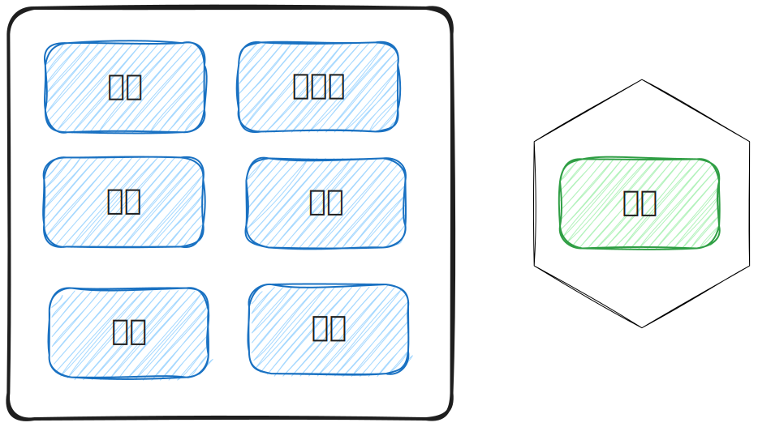
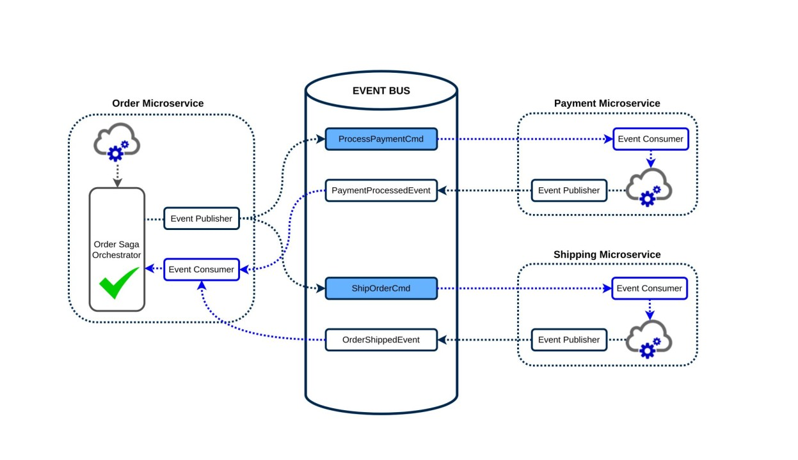
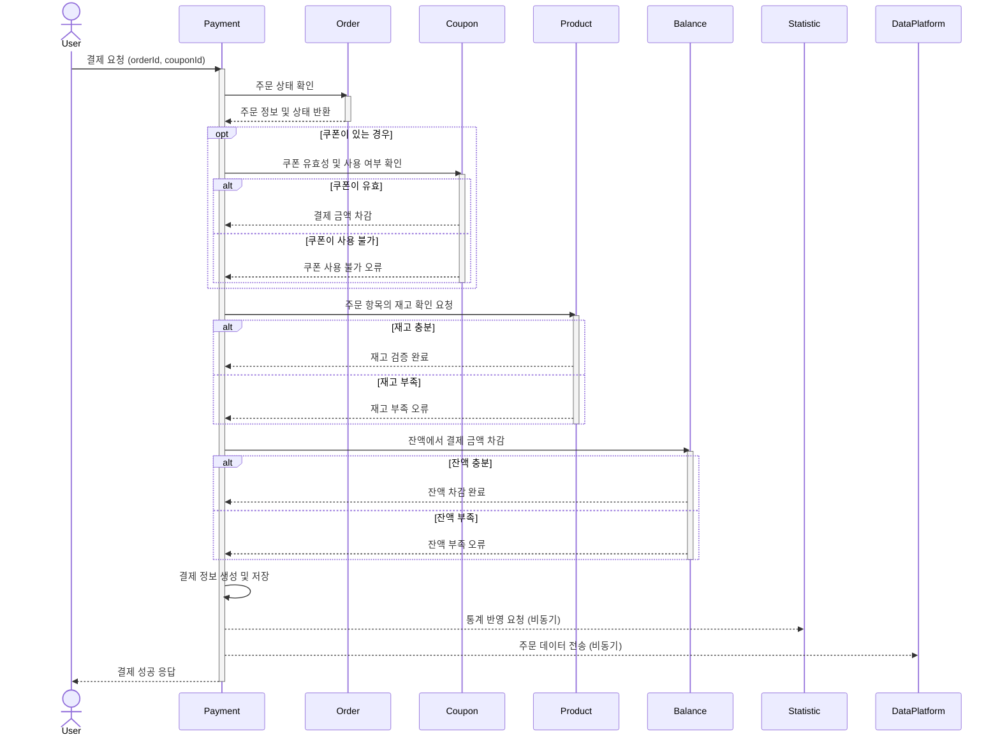

# E-커머스 서비스 MSA 전환 설계

## 서론: 왜 MSA 전환을 고려하는가?

현재 우리 E-커머스 서비스는 모놀리식 구조를 가지고 있습니다.  
이는 개발 생산성, 배포 용이성 등에 있어서는 장점을 가지지만, 앞으로 서비스가 성장함에 따라 다음과 같은 문제들이 발생할 수 있을 것입니다.

- **단일 장애점 (Single Point of Failure)**

하나의 서비스가 실패하면 전체 시스템이 마비될 수 있습니다.

- **긴 트랜잭션으로 인한 병목 발생 가능성**

트랜잭션이 길어서 데이터베이스 커넥션도 길게 점유하고 있습니다.  
이에 따라 락 경합 및 처리 지연이 자주 발생할 수도 있습니다.

- **서비스 확장이 Scale-Up 중심**

서비스가 확장되어 감에 따라, 단일 애플리케이션의 복잡도는 점점 커질 것입니다.  
모놀리식 구조는 상황에 따른 유연한 확장 전략을 세우기 까다로우며, 도메인 간의 강결합으로 인해 각 도메인들이 독립적으로 확장하기에도 어려운 구조입니다.

위와 잠재적 문제점들이 있기 때문에, 우리 E-커머스 서비스 또한 향후 서비스 확장을 위해 MSA로의 전환을 고려해봐야 합니다.

<br>

## 점진적 MSA 전환 방식

전체 서비스를 일시에 MSA로 전환하는 방식은 현실적으로 불가능하며, 위험 부담도 상당합니다.  
또한 현재 서비스 내 도메인 간 의존도가 높은 상태이기 때문에, **시스템 복잡도를 고려한 점진적 전환 방식**이 맞다고 판단했습니다.  
점진적 전환 방식을 위한 세부 규칙은 다음과 같습니다.

### 한 번에 하나의 도메인을 분리한다

이 방식은 전환 작업에 따른 장애 발생 시의 영향 범위를 최소화할 수 있으며, 또한 문제가 발생했을 때에도 빠르게 원래 구조로 복구할 수 있다는 장점이 있습니다.  
또한 배포 및 운영에 대한 부담도 분산시킬 수 있습니다.



도메인 분리의 순서를 정하기 위해서는 각 도메인들의 병렬 확장의 수요를 파악할 필요가 있습니다.  
우리 서비스 같은 경우에는 특히 **결제 도메인**이 비즈니스적으로도 가장 민감한 영역이며, 이벤트성 트래픽에 가장 큰 영향을 받을 수 있기 때문에 최우선적으로 분리해야 할 대상이라고 볼 수 있습니다.

### 논리적 분리 → 물리적 분리

실제 MSA 기반의 작은 서비스들을 구성 및 배포하기에 앞서, 모놀리식 애플리케이션 내부에서 **이벤트 기반의 논리적 도메인 분리** 작업을 수행할 수 있습니다.  
논리적 분리 작업은 단순히 MSA 전환 뿐만 아닌 다양한 장점들을 챙길 수 있게 해줍니다.

- **분산 트랜잭션**

우선, 하나의 긴 트랜잭션을 여러 개의 **분산 트랜잭션**으로 분리할 수 있습니다.  
이는 모놀리식 구조 내에서도 도메인 간 결합도를 낮출 수 있게 해주며, 이에 따라 도메인 경계를 보다 명확히 파악할 수 있게 됩니다.

- **변경 작업 비용 축소**

실제 MSA 전환 작업을 진행할 때 변경 비용이 작아집니다.  
도메인 간 비즈니스 로직이 느슨하게 연결되어 있으므로, 도메인 단위 분리가 비교적 쉬워집니다.  
그리고 이미 이벤트 기반 아키텍처가 구성되어 있을 것이므로 Kafka, MQ 등의 외부 이벤트 시스템을 도입할 때도 부담이 적을 것입니다.

향후 논리적 분리 작업 이후의 **물리적 MSA 분리 작업**은 다음과 같은 변경사항들과 함께 확장이 진행될 것입니다.

- 이벤트 발행 주체: Spring Event → Kafka Topic
- 도메인 별 서비스: 모놀리식 → 독립 서비스 및 독립 DB 배포

**논리적 분리 → 물리적 분리** 전략은 안전하고 점진적인 MSA 전환 작업을 위한 현실적인 전략이라고 할 수 있습니다.  
이러한 전략을 통해 MSA 전환 비용 및 운영 부담을 획기적으로 줄여줄 수 있을 것이라고 생각합니다.

<br>

## Saga orchestration 패턴을 활용한 결제 도메인 '논리적 분리'

앞서 언급한대로 **결제 도메인**은 핵심적인 비즈니스 요구사항을 담고 있으며 복잡한 내부 구현을 포함하고 있습니다.  
따라서 결제 로직에 대한 **'논리적 분리'** 작업을 우선적으로 진행했으며, 해당 작업에 대한 사항들을 본 설계 문서에도 참고 목적으로 녹여내 보고자 합니다.

### 기존 결제 Facade 로직

```kotlin
@Transactional
@DistributedLock(lockType = LockType.PUBSUB)
fun pay(command: PaymentCommand): PaymentResult {
    // 1. 주문 조회 및 상태 확인
    // 2. 재고 검증 및 차감
    // 3. 쿠폰 유효성 검사 및 할인 금액 계산
    // 4. 결제 금액 계산
    // 5. 잔액 차감
    // 6. 잔액 변경 내역 저장
    // 7. 결제 정보 저장
    // 8. 통계 반영
    // 9. 일일 상품 판매량 집계 (비동기)
    // 10. 데이터 플랫폼 전송 (비동기)

    return PaymentResult.from(payment)
}
```

기존 로직은 비동기 작업들을 제외하고도 하나의 트랜잭션에서 많은 작업들을 수행하고 있습니다.  
이는 락 경합을 유발할 수 있고, 성능에도 심각한 영향을 줄 수 있습니다.

### Saga orchestration 패턴



\* 이미지 출처: [LinkedIn - Do you know how the orchestration-based saga works?](https://www.linkedin.com/pulse/do-you-know-how-orchestration-based-saga-works-siva-nadupuru/)

위 문제를 해결하기 위해 저는 **Saga 패턴**을 도입해서 도메인 간 흐름을 이벤트 기반으로 느슨하게 연결하기로 결정했습니다.  
Saga 패턴에는 대표적인 2가지 방식이 존재합니다.

- **Choreography 방식**: 참여자 각자가 이벤트를 발행하고, 서로의 이벤트를 주고받는 방식
- **Orchestration 방식**: 하나의 중앙 오케스트레이터가 이벤트들의 전체 흐름을 제어하는 방식

이 중에서 저는 **Orchestration 방식**을 채택했고, 그 이유는 다음과 같습니다.

- 결제는 도메인끼리 연관되는 기능이 많고 단계가 복잡하므로 중앙 제어 방식이 효율적입니다.
- Spring Event만으로 이벤트 기반 아키텍처를 구현할 때 Choreography 방식에 비해 전체적인 구조 파악에 용이하며, 보다 명시적으로 예외에 대응할 수 있습니다.

Spring의 `@EventListener` 기능을 중점적으로 활용해서 이벤트 기반 오케스트레이션을 구현했습니다.  
도메인들의 모든 동작은 각자의 EventListener에서 처리되고, 오케스트레이터는 이벤트 수신 및 전송을 통해서 결제의 전체 흐름을 제어합니다.

### 결제 Sequence Diagram

결제 로직을 Orchestration 방식의 Event 기반 아키텍처로 변경했으며, 이에 따라 Sequence Diagram이 다음과 같이 변경되었습니다.

**AS-IS**



**TO-BE**

결제 Success Flow


결제 Fail Flow


이로써 결제 도메인에 대한 '이벤트 기반 논리적 분리 작업'을 수행할 수 있었습니다.  
이 작업으로 인해 도메인 경계에 기반한 트랜잭션 분산 및 보상 트랜잭션 기반의 복구 기능을 갖춘 구조로 전환할 수 있었습니다.  
앞으로도 다른 도메인들에 대해 점진적인 전환을 적용해 나간다면 보다 유연하고 확장 가능한 아키텍처를 구축할 수 있을 것이며, MSA로의 전환에 대한 부담도 줄여나갈 수 있을 것입니다.

<br>

## MSA를 위한 도메인 배포 단위 설계

MSA 전환을 진행한다면 아래와 같이 서비스를 분리할 계획입니다.

| 도메인        | 주요 책임                                                   |
|:------------:|----------------------------------------------------------|
| 고객/잔액      | 고객 정보 관리, 잔액 및 내역 관리, 인증 및 권한                   |
| 상품/재고      | 상품 정보, 옵션, 재고 수량 관리                           |
| 쿠폰          | 쿠폰 발급, 사용, 만료 등 프로모션 정책 관리                  |
| 주문          | 주문 생성, 주문 상태 흐름 제어                              |
| 결제          | 주문에 대한 결제 로직 수행                            |
| 통계          | 판매량 기록 및 인기 상품 집계                          |

### 고객/잔액 서비스

- 주요 기능
  - 사용자 프로필 관리
  - 사용자 인증 및 권한 부여
  - 사용자 잔액 관리
- 운영 특이사항
  - 사용자 세션 정보를 저장하기 위한 *Redis* 활용
  - 잔액 내역은 보존 기간이 길면서 조회 빈도는 적으므로, 오래된 내역에 대해서는 *Cold Data Storage* 활용에 대한 검토 필요

### 상품/재고 서비스

- 주요 기능
  - 상품, 옵션, 재고에 대한 조회 기능
  - 상품 판매 발생 시 재고 차감
- 운영 특이사항
  - 조회 트래픽이 빈번하므로, DB와 함께 캐시 용도의 *Redis* 활용

### 쿠폰 서비스

- 주요 기능
  - 선착순 쿠폰 발급
  - 결제 시 쿠폰 사용
  - 사용자 보유 쿠폰 조회
- 운영 특이사항
  - 쿠폰 선착순 발급 처리를 위한 *Redis* 활용

### 주문 서비스

- 주요 기능
  - 주문 생성
  - 주문 상태 확인 및 상태 전이
- 운영 특이사항
  - 상태 흐름이 중요하므로, *이벤트 소싱*을 활용해 상태 변경 이벤트를 순차적으로 저장하는 방안에 대해 검토 필요

### 결제 서비스

- 주요 기능
  - 주문서에 대한 결제 처리
- 운영 특이사항
  - 이벤트성 대량 트래픽에 취약하므로 서버 수평 확장 방식 고려
  - Kafka를 활용해서 다른 도메인들과 이벤트 기반으로 통신

### 통계 서비스

- 주요 기능
  - 상품 판매량 저장
  - 인기 상품 집계
- 운영 특이사항
  - 다른 도메인들과 밀접한 연관 없이 어느 정도 고립된 방식의 운영 가능
  - *Redis* Sorted Set을 활용한 랭킹 집계

분리된 각 서비스들은 위와 같은 기능 및 역할을 수행할 것입니다.  
그리고 서비스들 간의 연결은 *Kafka* 및 *gRPC*를 활용해 상호 통신하는 방식으로 검토 중입니다.  
아직은 MSA 전환에 대한 제반사항들이 모두 제공된 상태는 아니기 때문에 섣불리 판단하기 어려운 부분들도 존재합니다.  
그래도 위와 같은 구성을 활용한다면 충분히 상황에 따라 유연한 방식으로 MSA 전환을 달성할 수 있으리라 생각됩니다.

<br>

## 더 생각해볼 만한 부분들

이번 설계는 MSA 전환을 위한 사전 작업에 필요한 것들 위주로 기획되었습니다.  
따라서 실제 MSA 전환을 달성하고자 한다면 아래와 같은 사항들을 추가적으로 고려해봐야 합니다.

### Zero-Payload 이벤트

현재 구현된 이벤트 기반 결제 로직의 이벤트들은 다소 **Rich Payload**인 경향이 있습니다.  
이는 Spring Event 기반으로 내부적인 이벤트 처리 방식에서는 큰 문제가 아닐 수 있습니다.  
하지만 MSA로 전환하고 각 서비스가 이벤트 기반으로 통신하게 되었을 때에도 이벤트의 크기가 크다면 성능상의 문제가 발생할 수 있습니다.  
Zero-Payload를 활용한다면 서비스 간 의존도를 낮출 수 있다는 장점이 있습니다만, 이에 따른 트레이드오프 또한 면밀히 검토한 후 도입되어야 할 것입니다.

### CQRS (Command Query Responsibility Segregation)

현재 우리 서비스는 단일 애플리케이션이 단일 DB와 연결되어 있는 형태입니다.  
차후 MSA로 전환하게 되어 서비스들이 나눠진다면 각 서비스들이 **읽기/쓰기 패턴**에서 뚜렷한 차이점을 보일 수 있습니다.  
이런 경우 CQRS 패턴을 도입한다면 각 서비스에 최적화된 방식으로 유연하게 DB를 관리할 수 있게 될 것입니다.

### Circuit Breaker 패턴

서비스가 여러 개로 분산되면 하나의 서비스 장애가 전체 시스템에 영향을 줄 수 있다는 위험 요소가 생깁니다.  
따라서 Circuit Breaker 패턴을 도입해서, 요청에 대한 실패가 '임계치(threshold)'에 도달했을 때 요청 차단 및 Fail Fast 하게 처리하는 방식을 검토해볼 수 있을 것입니다.

### 분산 추적 도구

MSA는 서비스가 많아지므로 에러에 대한 추적이 어려워질 수 있습니다.  
따라서 여러 서비스들을 거쳐가는 이벤트 흐름을 추적하기 위한 **분산 추적(Distributed Tracing)** 도구가 필요해질 수 있습니다.
